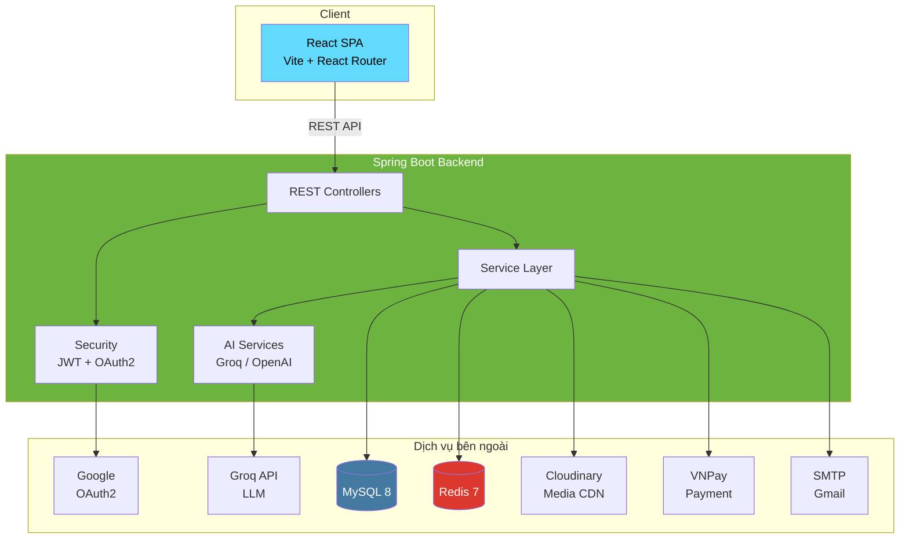
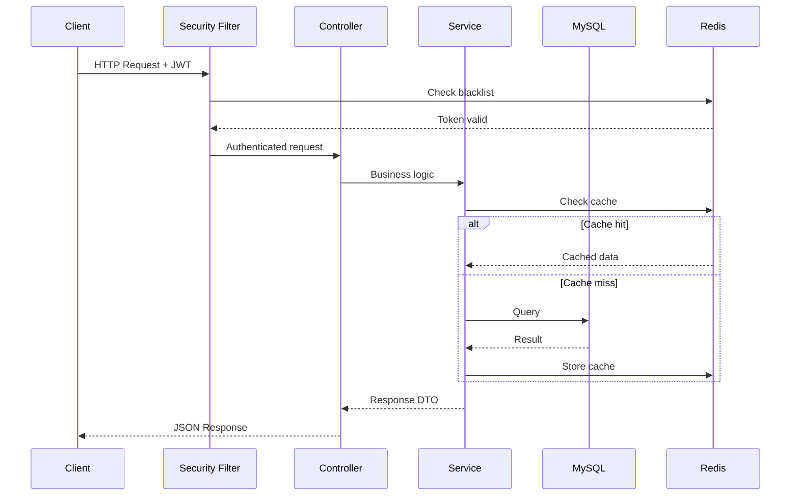
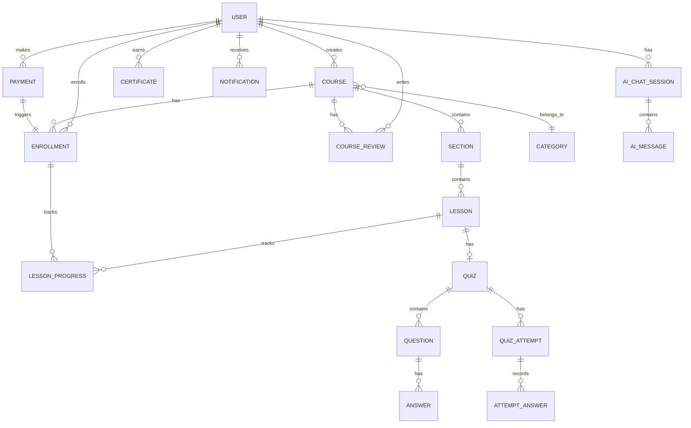
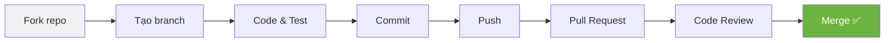

<div align="center">

# 🎓 BTM Learning

**Nền tảng học trực tuyến thông minh — được xây dựng bằng Spring Boot & AI**

[](https://spring.io/projects/spring-boot)
[](https://openjdk.org/)
[](https://www.mysql.com/)
[](https://redis.io/)
[](https://www.docker.com/)
[](LICENSE)

[Tính năng](#-tính-năng-chính) · [Cài đặt](#-cài-đặt) · [Cấu hình](#-cấu-hình-môi-trường) · [Kiến trúc](#-kiến-trúc-tổng-quan) · [Đóng góp](#-hướng-dẫn-đóng-góp) · [Roadmap](#-roadmap)

</div>

---

## 📖 Giới thiệu

**BTM Learning** là một nền tảng E-Learning full-stack, cung cấp trải nghiệm học tập trực tuyến hoàn chỉnh từ quản lý khóa học, kiểm tra đánh giá, đến cấp chứng chỉ tự động.

Điểm nổi bật của dự án là tích hợp sâu **Trí tuệ nhân tạo (AI)** vào quy trình học tập — bao gồm chatbot trợ lý, tự động sinh câu hỏi, chấm điểm tự luận và gợi ý khóa học cá nhân hóa.

### Tại sao chọn BTM Learning?

- 🤖 **AI-First** — AI không chỉ là tính năng phụ mà là cốt lõi của trải nghiệm học tập
- 🏗️ **Production-Ready** — JWT + OAuth2, rate limiting, caching, Docker deployment
- 💳 **Thanh toán tích hợp** — VNPay gateway với xác thực HMAC-SHA512
- 📜 **Chứng chỉ xác minh được** — Tự động sinh PDF, public verification API
- 🎬 **HLS Streaming** — Video chunked upload lên đến 500MB, transcode tự động

---

## ✨ Tính năng chính

### 🔐 Xác thực & Bảo mật

- Đăng ký / Đăng nhập với **JWT** (Access + Refresh Token)
- Đăng nhập nhanh qua **Google OAuth2**
- Phân quyền 3 vai trò: `STUDENT` · `INSTRUCTOR` · `ADMIN`
- Token blacklist khi logout, refresh token lưu Redis
- **Rate Limiting** với Bucket4j

### 📚 Quản lý Khóa học

- Danh mục cây cha-con (hierarchical categories)
- Vòng đời: `DRAFT` → `PENDING` → `ACTIVE` → `ARCHIVED`
- Full-text search + lọc đa tiêu chí
- Chương (Section) & Bài học (Lesson) với drag-and-drop reorder
- Hỗ trợ 4 loại bài học: `VIDEO` · `DOCUMENT` · `TEXT` · `QUIZ`

### 🤖 Tích hợp AI

| Tính năng | Mô tả |
|-----------|-------|
| **Chatbot** | Trợ lý học tập theo ngữ cảnh khóa học, SSE streaming, lưu 20 tin nhắn |
| **Quiz Generator** | Cung cấp nội dung → AI tự động sinh câu hỏi trắc nghiệm |
| **Essay Grading** | Chấm tự luận tự động, trả về điểm 0.0–1.0 + nhận xét chi tiết |
| **Recommendation** | Gợi ý khóa học dựa trên lịch sử học tập & sở thích cá nhân |

### 💳 Thanh toán & Ghi danh

- Cổng thanh toán **VNPay** (sandbox & production)
- Webhook xác thực **HMAC-SHA512**
- Hệ thống **Voucher** giảm giá
- Tự động ghi danh sau thanh toán thành công

### 📊 Tiến độ & Chứng chỉ

- Theo dõi tiến độ video real-time (giây đã xem)
- Mở khóa bài học tuần tự (sequential unlock)
- Tự động sinh **chứng chỉ PDF** khi hoàn thành 100%
- API xác minh chứng chỉ công khai cho nhà tuyển dụng

### ⭐ Tương tác & Thông báo

- Đánh giá khóa học 1–5 sao + bình luận
- Thông báo đa kênh: **In-app** + **Email** (JavaMailSender + Thymeleaf)

### 🛡️ Quản trị (Admin)

- Dashboard thống kê (cached Redis): users, courses, revenue
- Kiểm duyệt khóa học `PENDING` → `ACTIVE` / từ chối kèm lý do
- Quản lý người dùng: tìm kiếm, khóa/mở, thay đổi role

---

## 🏗 Kiến trúc tổng quan



### Request Flow



### Database ER Diagram



---

## 🛠 Cài đặt

### Yêu cầu hệ thống

| Công cụ | Phiên bản | Bắt buộc |
|---------|-----------|----------|
| Java | 17+ | ✅ |
| Maven | 3.9+ | ✅ |
| MySQL | 8.0+ | ✅ |
| Redis | 7+ | ✅ |
| Docker | 24+ | Khuyên dùng |
| Docker Compose | 2.0+ | Khuyên dùng |

### Bước 1: Clone repository

```bash
git clone https://github.com/Theiz15/BTM-Learning.git
cd BTM-Learning
```

### Bước 2: Cấu hình môi trường

```bash
# Tạo file .env từ template
cp .env.example .env

# Chỉnh sửa các biến môi trường (xem phần Cấu hình bên dưới)
```

---

## 🚀 Chạy project

### Option 1: Docker Compose (Khuyên dùng)

Chạy toàn bộ hệ thống (MySQL + Redis + App) chỉ với một lệnh:

```bash
# Khởi chạy tất cả services
docker-compose up -d

# Xem logs real-time
docker-compose logs -f app

# Dừng toàn bộ
docker-compose down
```

> **📍 App URL:** `http://localhost:8080`

### Option 2: Development Mode

Chạy thủ công cho quá trình phát triển:

```bash
# 1. Khởi động infrastructure bằng Docker
docker-compose up -d mysql redis

# 2. Chạy Spring Boot app
./mvnw spring-boot:run

# Hoặc trên Windows
mvnw.cmd spring-boot:run
```

> **📍 App URL:** `http://localhost:8088`

### Kiểm tra hoạt động

```bash
# Health check
curl http://localhost:8088/api/v1/courses

# Đăng ký tài khoản mới
curl -X POST http://localhost:8088/api/v1/auth/register \
  -H "Content-Type: application/json" \
  -d '{
    "fullName": "Nguyen Van A",
    "email": "test@example.com",
    "password": "password123"
  }'
```

---

## ⚙ Cấu hình môi trường

Tạo file `.env` tại thư mục gốc dự án:

```env
# ╔══════════════════════════════════════════╗
# ║           SERVER CONFIGURATION           ║
# ╚══════════════════════════════════════════╝
SERVER_PORT=8088
API_PREFIX=/api/v1

# ╔══════════════════════════════════════════╗
# ║              DATABASE (MySQL)            ║
# ╚══════════════════════════════════════════╝
DB_URL=jdbc:mysql://localhost:3306/btm_learning
DB_USERNAME=root
DB_PASSWORD=your_mysql_password

# ╔══════════════════════════════════════════╗
# ║              CACHE (Redis)               ║
# ╚══════════════════════════════════════════╝
REDIS_HOST=localhost
REDIS_PORT=6379

# ╔══════════════════════════════════════════╗
# ║         AUTHENTICATION (JWT)             ║
# ╚══════════════════════════════════════════╝
# Tạo key: openssl rand -hex 32
JWT_SIGNER_KEY=your_256bit_hex_secret_key

# ╔══════════════════════════════════════════╗
# ║          GOOGLE OAUTH2                   ║
# ╚══════════════════════════════════════════╝
# Lấy tại: https://console.cloud.google.com/apis/credentials
CLIENT_ID=your_google_client_id.apps.googleusercontent.com
GOOGLE_CLIENT_SECRET=your_google_client_secret
URL_FRONTEND=http://localhost:5173/oauth2/redirect

# ╔══════════════════════════════════════════╗
# ║         MEDIA STORAGE (Cloudinary)       ║
# ╚══════════════════════════════════════════╝
# Đăng ký tại: https://cloudinary.com
CLOUDINARY_CLOUD_NAME=your_cloud_name
CLOUDINARY_API_KEY=your_api_key
CLOUDINARY_API_SECRET=your_api_secret

# ╔══════════════════════════════════════════╗
# ║        PAYMENT GATEWAY (VNPay)           ║
# ╚══════════════════════════════════════════╝
# Đăng ký sandbox: https://sandbox.vnpayment.vn
TMN_CODE=your_tmn_code
HASH_SECRET=your_hash_secret
PAY_URL=https://sandbox.vnpayment.vn/paymentv2/vpcpay.html
RETURN_URL=http://localhost:8088/api/v1/payments/vnpay-return
API_URL_VNPAY=https://sandbox.vnpayment.vn/merchant_webapi/api/transaction
FRONTEND_RETURN_URL=http://localhost:5173/payment-return

# ╔══════════════════════════════════════════╗
# ║            AI / LLM (Groq)               ║
# ╚══════════════════════════════════════════╝
# Lấy API key tại: https://console.groq.com
API_URL_OPEN_AI=https://api.groq.com/openai/v1/chat/completions
API_KEY=your_groq_api_key
MODEL=llama-3.1-8b-instant

# ╔══════════════════════════════════════════╗
# ║           EMAIL (SMTP - Gmail)           ║
# ╚══════════════════════════════════════════╝
# Bật 2FA & tạo App Password:
# https://myaccount.google.com/apppasswords
MAIL_HOST=smtp.gmail.com
MAIL_PORT=587
MAIL_USERNAME=your_email@gmail.com
MAIL_PASSWORD=your_app_password
MAIL_FROM=your_email@gmail.com
```

---

## 📁 Cấu trúc thư mục

```
BTM-Learning/
│
├── 📄 docker-compose.yml          # MySQL + Redis + App orchestration
├── 📄 Dockerfile                  # Multi-stage build (Maven → JRE 17)
├── 📄 pom.xml                     # Maven dependencies
├── 📄 .env                        # Biến môi trường (không commit!)
│
└── src/main/
    ├── java/com/learning/btmlearning/
    │   │
    │   ├── 🚀 BtmLearningApplication.java
    │   │
    │   ├── 📂 configuration/               # Cấu hình framework
    │   │   ├── SecurityConfig.java         #   ├─ JWT + OAuth2 + CORS
    │   │   ├── RedisConfig.java            #   ├─ Cache + serializer
    │   │   ├── CloudinaryConfig.java       #   ├─ Media upload SDK
    │   │   ├── VNPayConfig.java            #   ├─ Payment gateway
    │   │   ├── OpenAiConfig.java           #   ├─ AI/LLM WebClient
    │   │   ├── JwtConfig.java              #   ├─ Token properties
    │   │   ├── JwtAuthenticationEntryPoint #   ├─ 401 error handler
    │   │   └── RateLimitInterceptor.java   #   └─ API throttling
    │   │
    │   ├── 📂 controller/                  # REST API layer (19 controllers)
    │   │   ├── AuthController              #   ├─ Register, Login, Refresh
    │   │   ├── CourseController             #   ├─ CRUD khóa học
    │   │   ├── LessonController            #   ├─ Bài học + tiến độ
    │   │   ├── QuizController              #   ├─ Quiz + chấm điểm
    │   │   ├── PaymentController           #   ├─ VNPay integration
    │   │   ├── AiChatController            #   ├─ Chatbot + recommendation
    │   │   ├── AiQuizController            #   ├─ AI quiz generation
    │   │   ├── EnrollmentController        #   ├─ Ghi danh
    │   │   ├── CertificateController       #   ├─ Chứng chỉ
    │   │   ├── NotificationController      #   ├─ Thông báo
    │   │   ├── AnalyticsController         #   ├─ Dashboard stats
    │   │   └── ...                         #   └─ Category, Section, Review...
    │   │
    │   ├── 📂 entity/                      # JPA Entities (22 tables)
    │   ├── 📂 dto/                         # Request & Response DTOs
    │   │   ├── request/
    │   │   └── response/
    │   ├── 📂 repository/                  # Spring Data JPA Repositories
    │   ├── 📂 service/                     # Business logic interfaces
    │   │   └── impl/                       # Implementations (26 services)
    │   ├── 📂 mapper/                      # MapStruct DTO ↔ Entity
    │   ├── 📂 constant/                    # Enums & constants
    │   ├── 📂 exception/                   # Global exception handling
    │   ├── 📂 component/                   # Spring components
    │   └── 📂 utils/                       # Utility classes
    │
    └── resources/
        ├── application.yaml                # App configuration
        └── templates/                      # Thymeleaf email templates
```

---

## 🤝 Hướng dẫn đóng góp

Chúng tôi rất hoan nghênh mọi đóng góp từ cộng đồng! Dù là sửa lỗi nhỏ, cải thiện docs, hay thêm tính năng mới — tất cả đều có giá trị.

### Quy trình đóng góp



```bash
# 1. Fork & clone
git clone https://github.com/<your-username>/BTM-Learning.git
cd BTM-Learning

# 2. Tạo branch mới
git checkout -b feature/amazing-feature

# 3. Commit theo conventional commits
git commit -m "feat: add course recommendation engine"
git commit -m "fix: resolve JWT refresh token race condition"
git commit -m "docs: update API endpoint documentation"

# 4. Push & tạo PR
git push origin feature/amazing-feature
```

### Quy ước commit message

| Prefix | Mô tả |
|--------|-------|
| `feat:` | Tính năng mới |
| `fix:` | Sửa lỗi |
| `docs:` | Cập nhật tài liệu |
| `refactor:` | Tái cấu trúc code |
| `test:` | Thêm/sửa test |
| `chore:` | Công việc maintenance |

---

## 📄 Giấy phép

Dự án được phân phối dưới giấy phép **MIT License**.

```
MIT License

Copyright (c) 2026 BTM Team

Permission is hereby granted, free of charge, to any person obtaining a copy
of this software and associated documentation files (the "Software"), to deal
in the Software without restriction, including without limitation the rights
to use, copy, modify, merge, publish, distribute, sublicense, and/or sell
copies of the Software, and to permit persons to whom the Software is
furnished to do so, subject to the following conditions:

The above copyright notice and this permission notice shall be included in all
copies or substantial portions of the Software.
```

---

## 🗺 Roadmap

Những tính năng đang được lên kế hoạch phát triển:

- [ ] 🔍 **Elasticsearch** — Full-text search nâng cao cho khóa học
- [ ] 📱 **Mobile App** — React Native cho iOS & Android
- [ ] 🌐 **Đa ngôn ngữ (i18n)** — Hỗ trợ English, Tiếng Việt
- [ ] 📊 **Learning Analytics** — Phân tích hành vi học tập chi tiết
- [ ] 🎥 **Live Streaming** — Lớp học trực tuyến real-time (WebRTC)
- [ ] 💬 **Discussion Forum** — Diễn đàn thảo luận theo khóa học
- [ ] 🏆 **Gamification** — Huy hiệu, điểm thưởng, bảng xếp hạng
- [ ] 📦 **Microservices** — Tách thành các service độc lập
- [ ] 🔔 **WebSocket Notifications** — Thông báo real-time
- [ ] 📈 **A/B Testing** — Tối ưu trải nghiệm người dùng

---

<div align="center">

### 🛠 Tech Stack

`Spring Boot` · `Java 17` · `MySQL` · `Redis` · `Docker` · `Cloudinary` · `VNPay` · `Groq AI` · `MapStruct` · `Lombok`

---

Made with ❤️ by **BTM Team**

[⬆ Về đầu trang](#-btm-learning)

</div>
